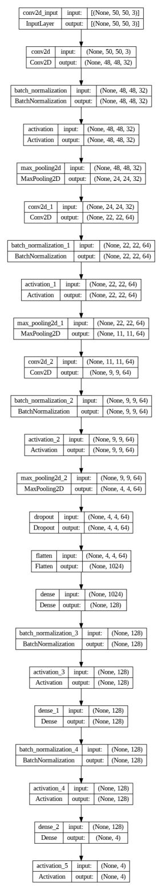

# Coffee Roast Classifier


This project classifies different types of coffee roasts using a Convolutional Neural Network (CNN) implemented in TensorFlow and Keras.

## Overview

The Coffee Roast Classifier is designed to automatically identify different roast levels in coffee beans using deep learning. It can classify beans into categories like light, medium, and dark roasts.

## Dataset

Dataset Source: Ontoum, S., Khemanantakul, T., Sroison, P., Triyason, T., & Watanapa, B. (2022). Coffee Roast Intelligence. arXiv preprint arXiv:2206.01841.
[Link to Dataset](https://arxiv.org/abs/2206.01841)

### Dataset Statistics
- Number of classes: [Add number]
- Total images: [Add number]
- Image dimensions: [Add dimensions]

## Project Structure

- `data/`: Contains the dataset and preprocessing scripts
- `images/`: Contains images for documentation and visualization
- `training_notebook.ipynb`: Main notebook containing the model training code

## Model Architecture



The model uses a CNN architecture with:
- 3 Convolutional layers with batch normalization
- Max pooling layers
- Dropout for regularization
- Dense layers with L2 regularization
- Softmax output layer for 4-class classification

Architecture Details:
1. Input Layer: 50x50x3 (RGB images)
2. Conv2D Layer 1: 32 filters, 3x3 kernel, ReLU activation + BatchNorm + MaxPool
3. Conv2D Layer 2: 64 filters, 3x3 kernel, ReLU activation + BatchNorm + MaxPool
4. Conv2D Layer 3: 64 filters, 3x3 kernel, ReLU activation + BatchNorm + MaxPool
5. Dropout Layer: 25% dropout rate
6. Dense Layer 1: 128 units, ReLU activation + BatchNorm
7. Dense Layer 2: 128 units, ReLU activation + BatchNorm
8. Output Layer: 4 units (Softmax activation)
## Results

[Add information about model performance, accuracy, and example predictions]

## Usage

### Requirements

- Python 3.x
- TensorFlow
- Keras
- OpenCV
- NumPy
- Matplotlib
- Scikit-learn
- Pandas

### Installation

1. Clone the repository:
   ```bash
   git clone https://github.com/VijayendraDwari/roastcoffeeClassifier.git
   cd roastcoffeeClassifier
