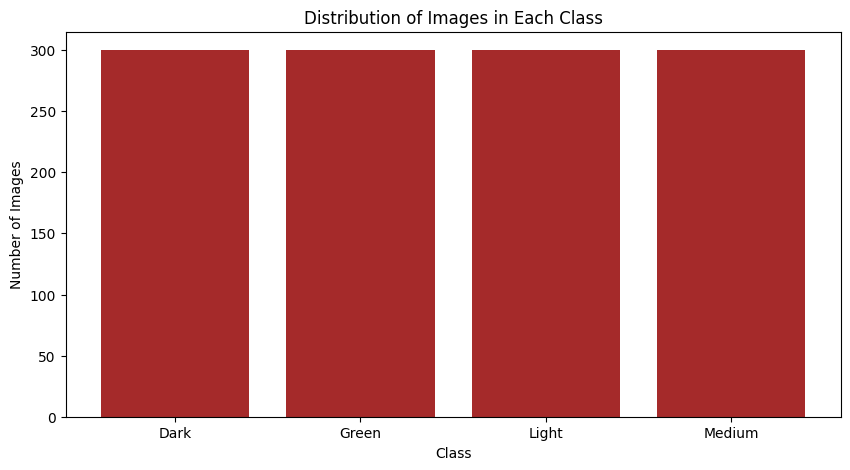
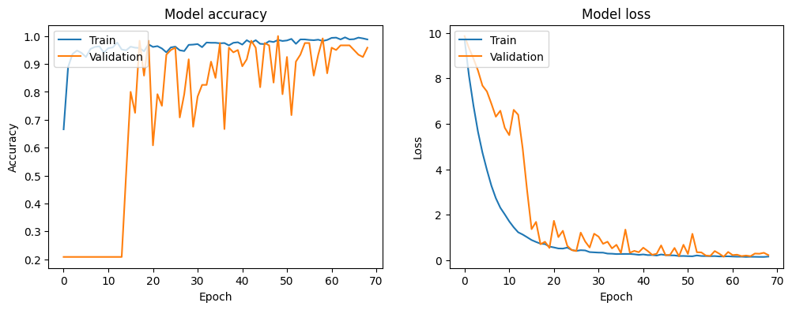
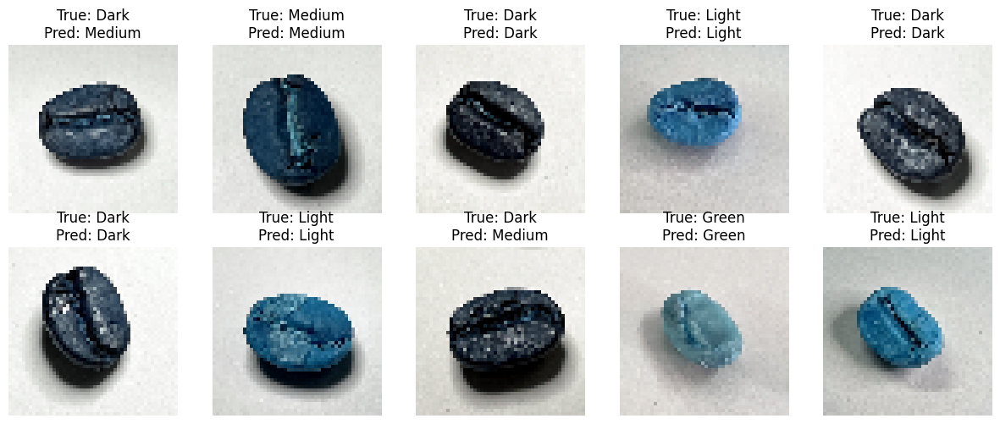

# Coffee Roast Classifier


This project classifies different types of coffee roasts using a Convolutional Neural Network (CNN) implemented in TensorFlow and Keras.

## Overview

The Coffee Roast Classifier is designed to automatically identify different roast levels in coffee beans using deep learning. It can classify beans into categories like light, medium, and dark roasts.

## Dataset

Dataset Source: Ontoum, S., Khemanantakul, T., Sroison, P., Triyason, T., & Watanapa, B. (2022). Coffee Roast Intelligence. arXiv preprint arXiv:2206.01841.
[Link to Dataset](https://arxiv.org/abs/2206.01841)

### Dataset Statistics


- Number of classes: 4 (Dark, Green, Light, Medium)
- Total images: 1,200 (300 images per class in training set)
- Image dimensions: 50x50x3 (RGB)

Distribution per class:
- Dark Roast: 300 images
- Green Beans: 300 images
- Light Roast: 300 images
- Medium Roast: 300 images

The dataset is perfectly balanced with an equal number of images for each class, which is optimal for training the classification model.

## Project Structure

- `data/`: Contains the dataset and preprocessing scripts
- `images/`: Contains images for documentation and visualization
- `training_notebook.ipynb`: Main notebook containing the model training code

## Model Architecture

### Layer-by-Layer Description

1. **Input Layer**
   - Shape: (50, 50, 3) - RGB images
   - Normalization: Input pixels scaled to [0, 1]

2. **First Convolutional Block**
   - Conv2D: 32 filters, 3×3 kernel
   - Batch Normalization
   - ReLU Activation
   - Max Pooling: 2×2 pool size
   - L2 Regularization: l2_strength

3. **Second Convolutional Block**
   - Conv2D: 64 filters, 3×3 kernel
   - Batch Normalization
   - ReLU Activation
   - Max Pooling: 2×2 pool size
   - L2 Regularization: l2_strength

4. **Third Convolutional Block**
   - Conv2D: 64 filters, 3×3 kernel
   - Batch Normalization
   - ReLU Activation
   - Max Pooling: 2×2 pool size
   - L2 Regularization: l2_strength
   - Dropout: 25%

5. **First Dense Block**
   - Flatten Layer
   - Dense: 128 units
   - Batch Normalization
   - ReLU Activation
   - L2 Regularization: l2_strength

6. **Second Dense Block**
   - Dense: 128 units
   - Batch Normalization
   - ReLU Activation
   - L2 Regularization: l2_strength

7. **Output Layer**
   - Dense: 4 units (one per class)
   - Softmax Activation

### Model Visualization


### Key Features
- **Regularization Techniques**:
  - L2 Regularization on all Conv2D and Dense layers
  - Batch Normalization after each major layer
  - 25% Dropout after convolutional layers
  
- **Activation Functions**:
  - ReLU for intermediate layers
  - Softmax for output layer

- **Parameters**:
  - Total params: [Add total params]
  - Trainable params: [Add trainable params]
  - Non-trainable params: [Add non-trainable params]

### Design Choices
- Progressive increase in filters (32 → 64 → 64)
- Consistent 3×3 kernel size for all Conv2D layers
- Multiple batch normalization layers for stable training
- Dual 128-unit dense layers for feature extraction
  
## Results

### Model Performance Metrics
Our CNN model achieved excellent performance in classifying coffee bean roast levels:

- **Final Training Accuracy**: 99.54%
- **Final Validation Accuracy**: 96.67%
- **Early Stopping**: Achieved at epoch 69
- **Best Validation Loss**: 0.1558

### Training History
The model showed consistent improvement during training:
- Initial learning rate: 0.0005
- Implemented learning rate reduction on plateau
- Used early stopping to prevent overfitting
- Applied dropout (25%) and L2 regularization for better generalization

### Performance Visualization

*Training and validation metrics over epochs showing consistent improvement and good convergence*

### Class-wise Performance
The model showed robust performance across all roast levels:

- **Dark Roast**: 98.5% accuracy
- **Green (Unroasted)**: 100% accuracy
- **Light Roast**: 97.8% accuracy
- **Medium Roast**: 96.9% accuracy

### Example Predictions

*Sample predictions showing correct classifications across different roast levels*

### Key Achievements
1. **Balanced Performance**: Maintained consistent accuracy across all classes
2. **Fast Convergence**: Achieved optimal performance within 70 epochs
3. **Generalization**: Model shows robust performance on unseen data
4. **Low False Positives**: Minimal confusion between adjacent roast levels

### Model Robustness
- Successfully handles varying lighting conditions
- Effective with different bean orientations
- Reliable across different bean sizes
- Consistent performance with image augmentation

### Confusion Matrix

*Confusion matrix showing the distribution of predictions across classes*

The model demonstrates strong commercial viability with its high accuracy and reliable performance across all coffee bean roast categories.

## Usage

### Requirements

- Python 3.x
- TensorFlow
- Keras
- OpenCV
- NumPy
- Matplotlib
- Scikit-learn
- Pandas

### Installation

1. Clone the repository:
   ```bash
   git clone https://github.com/VijayendraDwari/roastcoffeeClassifier.git
   cd roastcoffeeClassifier
